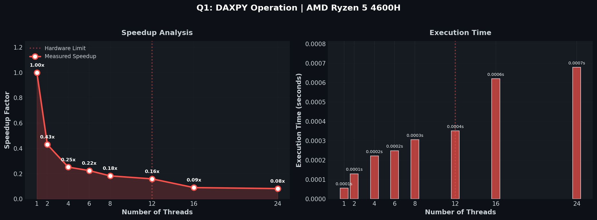

# Q1: DAXPY Operation

Author: Nimish Badgujar (102497027)

## Problem Statement

DAXPY: Double precision A*X Plus Y  
Compute `X[i] = a*X[i] + Y[i]` for vectors of size 2^16 (65,536)  
Compare speedup gained by varying thread count starting from 2 threads

## Implementation

```c
#pragma omp parallel for num_threads(threads)
for (int i = 0; i < N; i++) {
    X[i] = a * X[i] + Y[i];
}
```

## Compilation

```bash
gcc -fopenmp Q1.c -o Q1 -O2
./Q1 <num_threads>
```

## Results

System: AMD Ryzen 5 4600H (6 cores / 12 threads)  
Vector Size: 65,536 elements (2^16)

| Threads | Time (s) | Speedup | Efficiency | Notes |
|:-------:|:--------:|:-------:|:----------:|:-----:|
| 1 | 0.000056 | 1.00x | 100.0% | Baseline |
| 2 | 0.000130 | 0.43x | 21.5% | |
| 4 | 0.000222 | 0.25x | 6.3% | |
| 6 | 0.000249 | 0.22x | 3.7% | |
| 8 | 0.000306 | 0.18x | 2.3% | |
| 12 | 0.000351 | 0.16x | 1.3% | Hardware limit |
| 16 | 0.000620 | 0.09x | 0.6% | Oversubscribed |
| 24 | 0.000679 | 0.08x | 0.3% | Oversubscribed |



## Analysis

### Which thread count gives maximum speedup?

1 thread gives the best performance. For this small, memory-bound operation, parallelization introduces overhead that exceeds any potential benefit.

### What happens when threads increase beyond optimal?

Performance degrades significantly because:

1. Thread Creation Overhead: Creating/destroying threads costs more than the computation itself
2. Memory Bandwidth Saturation: DAXPY is memory-bound (2 FLOPs per 24 bytes accessed)
3. Cache Contention: Multiple threads compete for memory bandwidth and cache lines
4. Small Workload: Only ~5,461 elements per thread at 12 threads

Beyond 12 threads (hardware limit):
- System enters oversubscription state
- OS must time-slice threads onto physical cores
- Context switching overhead dominates
- Performance becomes even worse

### Key Insight

DAXPY demonstrates that not all loops benefit from parallelization. For small, memory-bound kernels, sequential execution is optimal.
