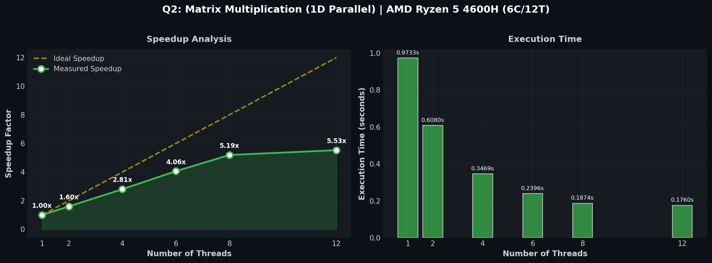
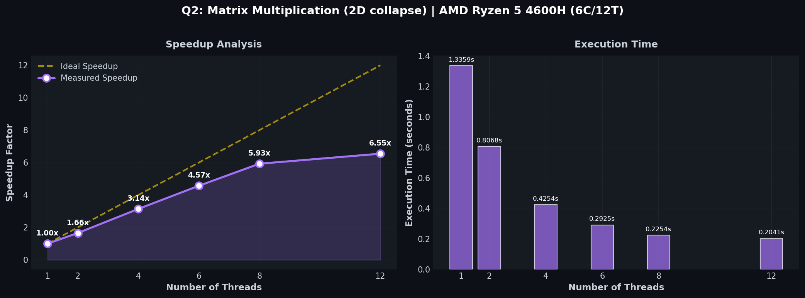

# Q2: Matrix Multiplication

## Problem Statement

> Build parallel matrix multiplication for 1000×1000 matrices  
> Implement two versions:
>
> 1. **1D Threading**: Parallelize single (outer) loop
> 2. **2D Threading**: Use `collapse(2)` to parallelize nested loops

---

## Implementation

### Part A - 1D Threading (Q2.c)

```c
#pragma omp parallel for num_threads(threads)
for (int i = 0; i < N; i++)
    for (int j = 0; j < N; j++)
        for (int k = 0; k < N; k++)
            C[i][j] += A[i][k] * B[k][j];
```

### Part B - 2D Threading (Q2b.c)

```c
#pragma omp parallel for collapse(2) num_threads(threads)
for (int i = 0; i < N; i++)
    for (int j = 0; j < N; j++)
        for (int k = 0; k < N; k++)
            C[i][j] += A[i][k] * B[k][j];
```

### Compilation

```bash
cd Part_1 && gcc -fopenmp Q2.c -o Q2 -O2
cd Part_2 && gcc -fopenmp Q2b.c -o Q2b -O2
```

---

## Results - 1D Threading

**System**: AMD Ryzen 5 4600H (6 cores / 12 threads)  
**Matrix Size**: 1000 × 1000

| Threads | Time (s) | Speedup | Efficiency |
| :-----: | :------: | :-----: | :--------: |
|    1    | 0.973297 |  1.00×  |   100.0%   |
|    2    | 0.608039 |  1.60×  |   80.0%    |
|    4    | 0.346913 |  2.81×  |   70.1%    |
|    6    | 0.239553 |  4.06×  |   67.7%    |
|    8    | 0.187394 |  5.19×  |   64.9%    |
|   12    | 0.175953 |  5.53×  |   46.1%    |



---

## Results - 2D Threading (collapse)

| Threads | Time (s) | Speedup | Efficiency |
| :-----: | :------: | :-----: | :--------: |
|    1    | 1.335878 |  1.00×  |   100.0%   |
|    2    | 0.806792 |  1.66×  |   82.8%    |
|    4    | 0.425374 |  3.14×  |   78.5%    |
|    6    | 0.292468 |  4.57×  |   76.1%    |
|    8    | 0.225359 |  5.93×  |   74.1%    |
|   12    | 0.204070 |  6.55×  |   54.6%    |



---

## Analysis

### Work Partitioning Strategy

**1D (Row Distribution)**:

- Each thread processes N/threads complete rows
- Good cache locality for row access
- Simple scheduling with low overhead

**2D (Collapsed Distribution)**:

- Iteration space = N×N = 1,000,000 iterations
- More balanced work distribution
- Better scalability at higher thread counts

### Comparison

| Metric              | 1D    | 2D    |
| ------------------- | ----- | ----- |
| Best 1-thread time  | 0.97s | 1.34s |
| Best 12-thread time | 0.18s | 0.20s |
| Max speedup         | 5.53× | 6.55× |

### Key Findings

1. **1D has lower overhead** - Faster single-threaded performance
2. **2D scales better** - Higher speedup at maximum threads
3. **Both plateau at 6 cores** - Beyond physical cores, SMT adds limited benefit
4. **Memory bandwidth limits scaling** - Matrix B access pattern causes cache misses

### Why Performance Degrades Beyond 6 Threads?

- Physical cores saturated
- SMT shares execution units
- Memory bandwidth becomes bottleneck
