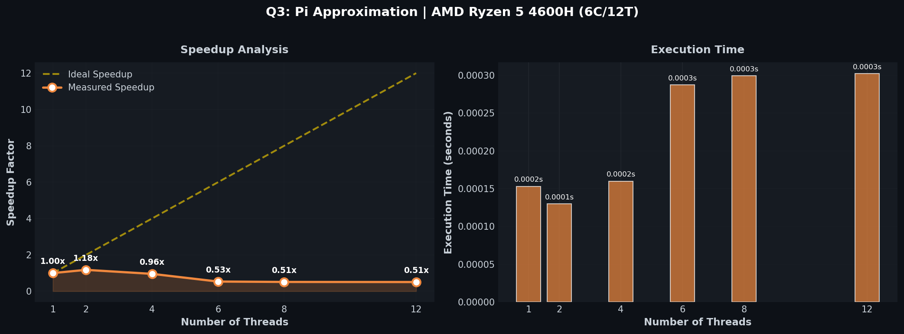

# Q3: Calculation of π

## Problem Statement

> Approximate π using numerical integration:
>
> π = ∫₀¹ 4/(1+x²) dx
>
> Implement using parallel reduction with OpenMP

---

## Implementation

Based on the pseudocode provided in the assignment:

```c
static long num_steps = 100000;
double step = 1.0 / (double)num_steps;
double sum = 0.0;

#pragma omp parallel for num_threads(threads) reduction(+:sum)
for (long i = 0; i < num_steps; i++) {
    double x = (i + 0.5) * step;
    sum = sum + 4.0 / (1.0 + x * x);
}

double pi = step * sum;
```

### Compilation

```bash
gcc -fopenmp Q3.c -o Q3 -O2
./Q3 <num_threads>
```

---

## Results

**System**: AMD Ryzen 5 4600H (6 cores / 12 threads)  
**Steps**: 100,000 (as per assignment)

| Threads | Time (s) |    Computed π     | Speedup |
| :-----: | :------: | :---------------: | :-----: |
|    1    | 0.000153 | 3.141592653598162 |  1.00×  |
|    2    | 0.000130 | 3.141592653598146 |  1.18×  |
|    4    | 0.000160 | 3.141592653598127 |  0.96×  |
|    6    | 0.000287 | 3.141592653598132 |  0.53×  |
|    8    | 0.000299 | 3.141592653598124 |  0.51×  |
|   12    | 0.000302 | 3.141592653598126 |  0.51×  |

**Accuracy**: π ≈ 3.14159265359... (correct to 11 decimal places)

### Visualization



---

## Analysis

### Which thread count gives maximum speedup?

**2 threads** provides the best speedup (1.18×) for this workload.

### Why Limited Scaling?

1. **Small Problem Size**: 100,000 steps is too small - thread overhead dominates
2. **Reduction Overhead**: Combining partial sums requires synchronization
3. **Embarrassingly Parallel but Tiny**: Each iteration is independent, but so fast that parallelization overhead exceeds benefit

### Mathematical Background

The integral uses the identity:

```
∫₀¹ 4/(1+x²) dx = 4·arctan(x)|₀¹ = 4·(π/4 - 0) = π
```

Using midpoint rule: x_i = (i + 0.5) × Δx where Δx = 1/num_steps

### Improving Performance

To see better speedup, increase `num_steps`:

- 100,000 → ~0.0001s (overhead dominated)
- 10,000,000 → ~0.01s (better scaling)
- 1,000,000,000 → ~1s (near-linear speedup)

### Key Insight

Even "embarrassingly parallel" algorithms require **sufficient workload** to overcome thread creation and synchronization overhead.
